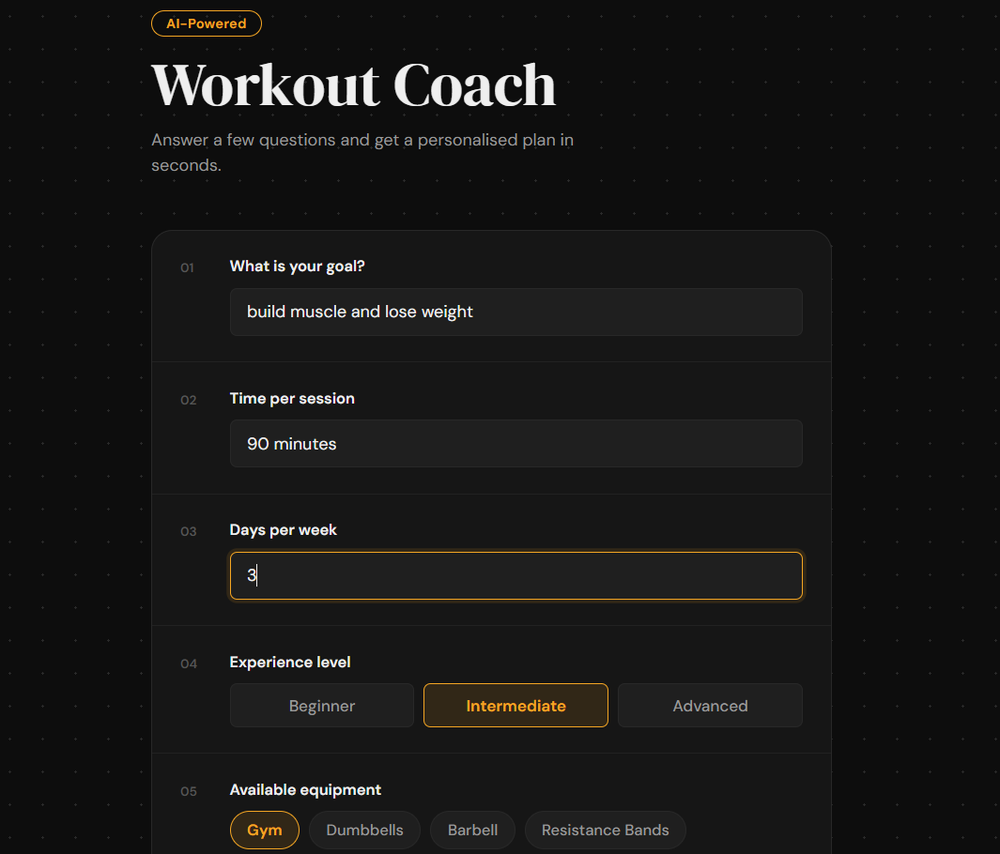
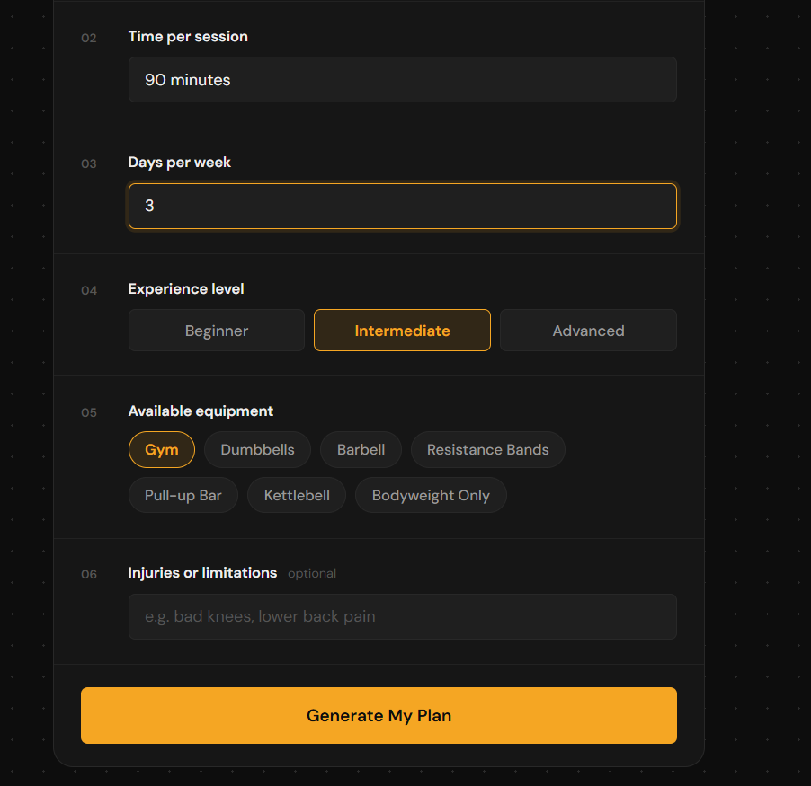
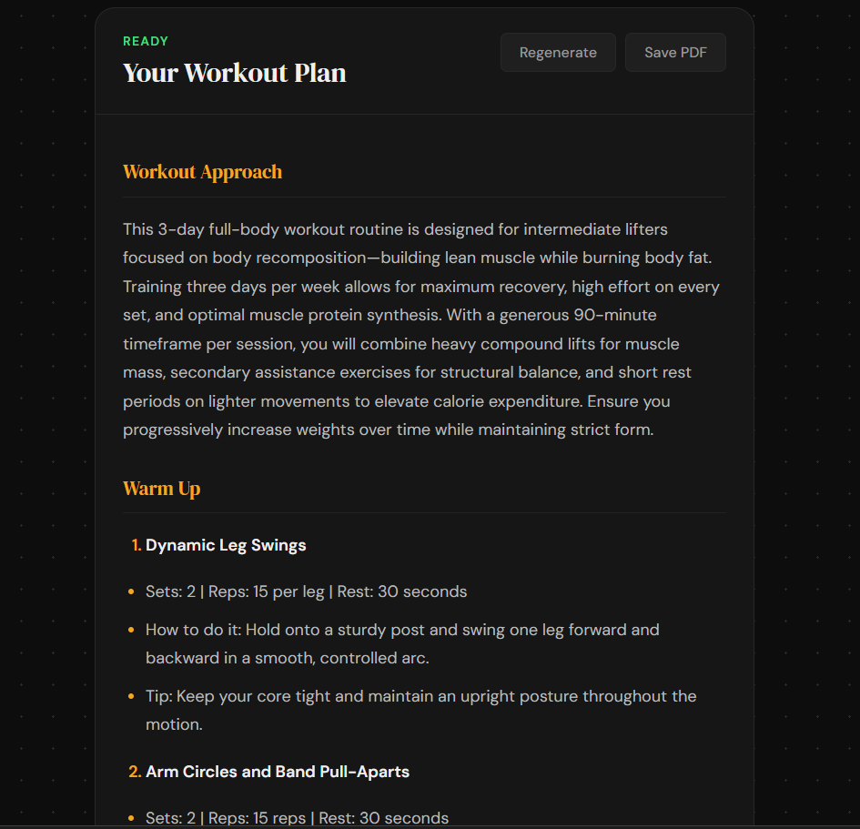
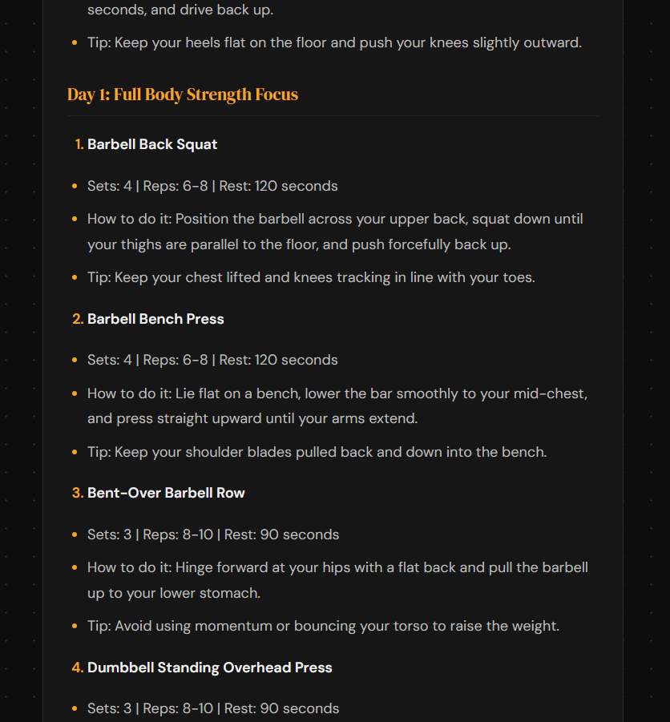

# AI Workout Coach

An AI-powered workout plan generator. Tell it your goal, available time, experience level, equipment, and any injuries — and it generates a structured, personalised workout plan in seconds. No more staring at a blank page trying to figure out what to do at the gym.

**[Live Demo →](https://workout-coach-frontend.vercel.app/)**

---

## Screenshots







---

## Features

- Personalised workout plans generated by Google Gemini AI
- Input your goal, session time, days per week, experience level, equipment, and injuries/limitations
- Equipment selection via interactive chip buttons
- Experience level selection (Beginner / Intermediate / Advanced)
- Structured markdown output with warm-up, main circuit, and cool-down sections
- Save your workout plan as a PDF
- Regenerate a new plan without clearing your inputs
- Loading state with disabled button to prevent duplicate requests
- Error handling for failed API calls
- Rate limiting on the backend to prevent API abuse

---

## Tech Stack

**Frontend**

- React (Vite)
- react-markdown
- Deployed on Vercel

**Backend**

- Node.js
- Express
- Google Gemini API (`gemini-3.6-flash`)
- Deployed on Render

---

## How It Works

```
User fills form → React sends POST request → Express backend → Gemini API → Workout plan returned → Displayed as formatted markdown
```

The frontend never touches the API key. All AI calls go through the Express backend, keeping the key secure on the server.

---

## Running Locally

### Prerequisites

- Node.js v20+
- A Google Gemini API key (free at [aistudio.google.com](https://aistudio.google.com))

### Backend

```bash
git clone https://github.com/prabesh-tandukar/workout_coach_frontend
cd workout-coach-backend
npm install
```

Create a `.env` file:

```
GEMINI_API_KEY=your_key_here
```

Start the server:

```bash
node server.js
```

Server runs on `http://localhost:3001`

### Frontend

```bash
cd workout-coach-frontend
npm install
npm run dev
```

App runs on `http://localhost:5173`

> Make sure the fetch URL in `App.jsx` points to `http://localhost:3001/generate-workout` when running locally.

---

## Project Structure

```
workout-coach-frontend/    # React + Vite frontend
├── src/
│   ├── App.jsx
│   ├── App.css
│   └── main.jsx

workout-coach-backend/     # Node.js + Express backend
├── server.js
├── .env                   # Not committed — add your own
└── package.json
```

---

## Deployment

- **Frontend:** Vercel — auto-deploys on every push to main
- **Backend:** Render — auto-deploys on every push to main. Add `GEMINI_API_KEY` as an environment variable in the Render dashboard.

> Note: Render's free tier puts the backend to sleep after 15 minutes of inactivity. The first request after a period of inactivity may take up to 60 seconds to respond.

---

## Author

**Prabesh Tandukar**

- GitHub: [@prabesh-tandukar](https://github.com/prabesh-tandukar)
- Location: Christchurch, New Zealand
